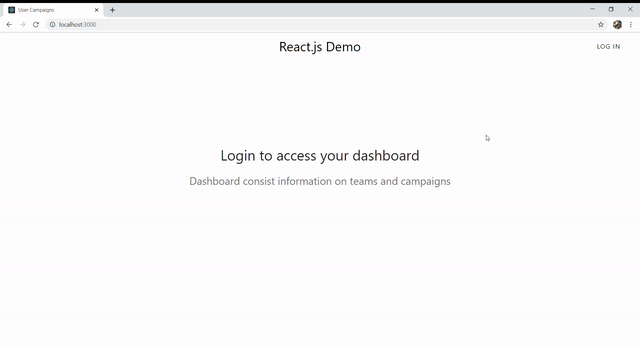

## Configuration

Make sure to add your own `MONGOURI` from your [mLab](https://account.mongodb.com/) database in `config/keys.js`.

```javascript
module.exports = {
  mongoURI: "YOUR_MONGO_URI_HERE",
  secretOrKey: "secret"
};
```

## Quick Start

```javascript
// Install dependencies for server & client
npm install && npm run client-install

// Run client & server with concurrently
npm run dev

// Server runs on http://localhost:5000 and client on http://localhost:3000
```

